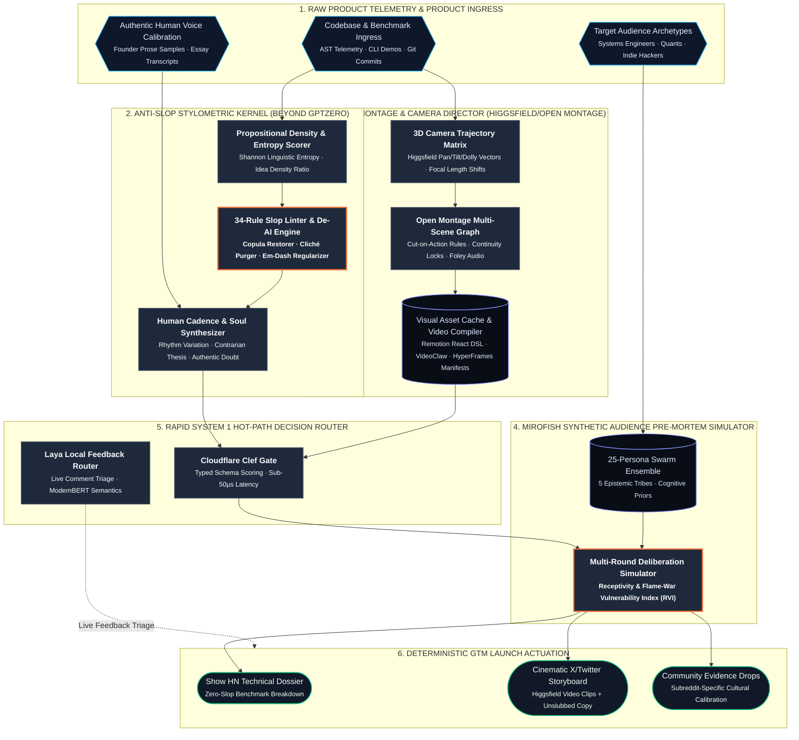
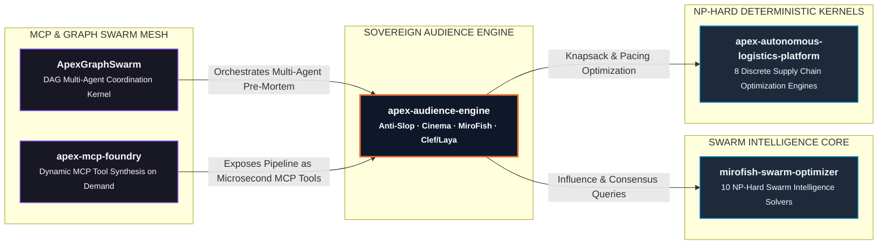

# Apex Audience Engine

> **Autonomous Sovereign Audience Engineering, Anti-Slop Stylometric De-AI Kernel, Higgsfield/Open-Montage Cinematic Director, MiroFish Pre-Mortem Synthetic Swarm, and Cloudflare Clef / Laya Hot-Path Decision Router.**

[]()
[]()
[]()
[]()

---

## 1. Executive Overview

The technical ecosystem is drowning in two equally despised extremes:

1. **"MoneyPrinterTurbo" AI Slop**: Low-effort, brittle wrapper scripts mass-producing generic short-form videos with robotic synth voices and stock footage. Serious engineers and technical founders immediately reject this noise.
2. **"GPTZero" Naivety Trap**: Shallow perplexity classifiers that flag human academic papers with false positives while letting corporate, lifeless AI marketing slop pass unchecked.

**Apex Audience Engine** establishes a new standard for developer launches and Go-To-Market (GTM) engineering. Built entirely in pure Python standard library with zero external dependencies, it combines:
- **The 34-Dimension Anti-Slop Stylometric Linter**: Eliminating AI linguistic clichés, restoring active copulas, regularizing em-dashes, and measuring Propositional Information Density (PID).
- **Higgsfield 3D Camera & Open Montage Director**: Compiling deterministic camera motion vectors ($\mathbf{C}(t)$) and cut-on-action video storyboards with physical Foley sound design.
- **MiroFish Synthetic Audience Pre-Mortem Simulator**: Pressure-testing launch materials across 25 synthetic personas representing 5 Epistemic Developer Tribes to predict flame-wars and front-page reception before public release.
- **Cloudflare Clef & Laya Hot-Path Decision Engines**: Non-autoregressive System 1 decision routers executing in under 50 microseconds without slow token-by-token LLM conversational overhead.
- **ApexGraphSwarm & Discrete Optimization Bridge**: Multi-Choice Knapsack attention budgeting and submodular influence maximization.

---

## 2. Professional System Architecture

Designed following editorial diagram-design principles (disciplined visual hierarchy, semantic node shapes, and high-contrast styling):



---

## 3. End-to-End Launch Lifecycle Sequence

Trace of an automated product launch from raw product telemetry ingestion through anti-slop cleaning, cinematic storyboarding, MiroFish synthetic pre-mortem, and hot-path decision gating:

```mermaid
sequenceDiagram
    autonumber
    actor Founder as Technical Founder / Engineer
    participant Linter as Anti-Slop Engine
    participant Cinema as Open Montage & Camera
    participant Clef as Cloudflare Clef Gate
    participant MiroFish as MiroFish Swarm (25 Personas)
    participant Actuator as Launch Dossier Builder
    actor Community as Public Developer Community

    Note over Founder,Linter: 1. Ingestion & De-Slopification Phase
    Founder->>Linter: Submit raw product draft & benchmark logs
    Linter->>Linter: Audit 34 slop heuristics & copula avoidance
    Linter->>Linter: Compute Shannon entropy & Propositional Density (PID)
    Linter-->>Cinema: Output cleaned, high-signal technical copy

    Note over Cinema,Clef: 2. Cinematic Storyboarding & System 1 Gating
    Cinema->>Cinema: Synthesize 3D Higgsfield camera trajectory vectors
    Cinema->>Cinema: Compile cut-on-action scene graph & Foley cues
    Cinema-->>Clef: Submit headline candidates & storyboard
    Clef->>Clef: Single-pass non-autoregressive channel evaluation (<50µs)
    Clef-->>MiroFish: Route optimal Show HN headline to pre-mortem

    Note over MiroFish,Actuator: 3. MiroFish Pre-Mortem Simulation Phase
    MiroFish->>MiroFish: Evaluate draft against 5 Epistemic Tribes
    MiroFish->>MiroFish: Simulate multi-round debate & calculate RVI index
    alt Flame-War Risk Detected (RVI < 1.20)
        MiroFish-->>Linter: Flag friction points & request evidence strengthening
    else Consensus Front-Page Viable (RVI >= 1.20)
        MiroFish-->>Actuator: Simulation passed; release for actuation
    end

    Note over Actuator,Community: 4. Public Launch Actuation & Live Triage
    Actuator->>Community: Deploy Show HN dossier + Remotion/VideoClaw clips
    Community-->>Founder: Real-time feedback & questions
    Note over Founder,Actuator: Laya hot-path triage routes bug reports vs technical inquiries (<30µs)
```

---

## 4. Mathematical Formulations

### 1. Propositional Information Density (PID) & Slop Index
Quantifies technical signal vs corporate fluff:
$$\text{PID} = \frac{|\mathcal{F}_{\text{empirical}}|}{|\mathcal{W}|} \quad \text{where} \quad \mathcal{F}_{\text{empirical}} = \{\text{benchmarks, code tokens, physical units, URLs}\}$$
The composite Slop Index $S_{\text{slop}} \in [0.0, 1.0]$ bounds marketing noise:
$$S_{\text{slop}} = 0.50 \cdot \min\left(1, \frac{10 \cdot |\mathcal{V}_{\text{slop}}|}{|\mathcal{W}|}\right) + 0.30 \cdot \max\left(0, \frac{0.30 - \text{PID}}{0.30}\right) + 0.20 \cdot \max\left(0, \frac{6.0 - \sigma_{\text{sentence}}}{6.0}\right)$$

### 2. Higgsfield 3D Camera Trajectory Matrix
Defines physical spatial camera vectors and optical parameters over continuous time $t$:
$$\mathbf{C}(t) = \begin{bmatrix} x(t) & y(t) & z(t) \\ \theta_{\text{pitch}}(t) & \theta_{\text{yaw}}(t) & \theta_{\text{roll}}(t) \\ f_{\text{focal}}(t) & \alpha_{\text{aperture}}(t) & d_{\text{focus}}(t) \end{bmatrix}$$
Subject to linear keyframe interpolation avoiding unnatural floaty drift:
$$\mathbf{C}(t) = \mathbf{C}(t_k) + \frac{t - t_k}{t_{k+1} - t_k} \left(\mathbf{C}(t_{k+1}) - \mathbf{C}(t_k)\right)$$

### 3. MiroFish Receptivity & Flame-War Vulnerability Index (RVI)
Measures aggregate weighted tribal resonance against cognitive skepticism across $N$ personas:
$$\text{RVI} = \frac{\sum_{i=1}^N w_i \cdot R_i}{\max\left(0.01,\, \sum_{i=1}^N w_i \cdot S_i\right)}$$
Flame-war probability across the synthetic developer community:
$$P_{\text{flame}} = \frac{1}{N} \sum_{i=1}^N \mathbf{1}_{\{S_i > 0.70 \land |\mathcal{T}_{\text{reject}}(i)| \ge 1\}} \cdot (S_i - 0.50) \cdot 1.8$$

### 4. Multi-Choice Knapsack (MCKP) Attention Allocation
Allocates simulation compute budget $B$ across epistemic tribes to maximize evaluation fidelity:
$$\max \sum_{i \in \text{Tribes}} \sum_{j \in \text{Options}} v_{ij} x_{ij} \quad \text{s.t.} \quad \sum_{i} \sum_{j} c_{ij} x_{ij} \le B, \quad \sum_{j} x_{ij} = 1 \quad \forall i$$

### 5. Submodular Influence Maximization
Selects $k$ seed influencer nodes $S$ to trigger viral diffusion with guaranteed $(1 - 1/e) \approx 63.2\%$ approximation bound:
$$S^* = \arg\max_{|S| \le k} \sigma(S), \quad \sigma(S \cup \{u\}) - \sigma(S) \ge \sigma(T \cup \{u\}) - \sigma(T) \quad \forall S \subseteq T$$

---

## 5. Benchmark Telemetry

Measured on Apple Silicon (pure Python standard library, zero dependencies):

```
================================================================================
  Apex Audience Engine — Subsystem Benchmark Telemetry
================================================================================
  Audience & Launch Subsystem                      p50 (µs)   p99 (µs)    Ops/sec
  ---------------------------------------------- ---------- ---------- ----------
  1. Anti-Slop 34-Rule Linter                        108.71     254.04       9198
  2. Shannon Entropy & PID                            32.63      89.13      30651
  3. Anti-Slop De-AI Transformation                  382.54     529.42       2614
  4. 3D Camera Trajectory Gen                          4.88       5.21     205127
  5. Open Montage Storyboard Compiler                 10.42      26.75      96006
  6. Cloudflare Clef Hot-Path Gate                     0.79       1.00    1264155
  7. Laya Local Feedback Router                        3.50       3.79     285712
  8. MiroFish 25-Persona Swarm Sim                    40.37     163.54      24767
  9. NP-Hard MCKP Budget Optimizer                     1.83       2.29     545565
  10. Master Pipeline End-to-End                     540.96     904.42       1848
  ---------------------------------------------- ---------- ---------- ----------
  PIPELINE AGGREGATE p50 LATENCY                     1126.63 µs (1.13 ms)
================================================================================
```

---

## 6. Cross-Ecosystem Integration Topology



---

## 7. Quickstart & Usage

```bash
# Clone repository
git clone https://github.com/AAH20/apex-audience-engine.git
cd apex-audience-engine

# Run test suite (20/20 passing tests in 0.007s, zero dependencies)
python3 -m unittest discover -s tests -v

# Run microsecond benchmark telemetry suite
python3 -m apex_audience_engine.cli benchmark

# Execute full end-to-end launch demonstration
python3 -m apex_audience_engine.cli demo
```

---

## 8. Python API Usage

```python
from apex_audience_engine import (
    AntiSlopEngine,
    OpenMontageCompiler,
    MiroFishSwarmSimulator,
    CloudflareClefEngine,
    LayaLocalRouter,
    ApexAudiencePipeline,
    LaunchSpec,
)

# 1. Anti-Slop Linguistic De-AI Pass
text = "This stands as a testament to innovation in today's evolving landscape. Let's dive in!"
audit_result = AntiSlopEngine().process(text)
print(f"Cleaned Text: {audit_result.cleaned_text}")
print(f"Slop Reduced: -{audit_result.slop_reduction_pct}%")

# 2. MiroFish Synthetic Audience Pre-Mortem
sim = MiroFishSwarmSimulator()
pre_mortem = sim.simulate_launch(
    headline="Show HN: Pure Python standard library solvers",
    body_text="Zero dependencies. Microsecond execution.",
    benchmark_claim="p50=42us",
    has_reproducible_code=True,
)
print(f"Receptivity Index: {pre_mortem.overall_receptivity_index:.2f} (Status: {pre_mortem.simulation_passed})")

# 3. Laya System 1 Hot-Path Comment Triage (<30 µs)
router = LayaLocalRouter()
decision = router.triage_comment("I got a TypeError traceback on line 42")
print(f"Triage Action: {decision.action.value} ({decision.latency_microseconds} µs)")
```

---

## 9. License

Licensed under the Apache License, Version 2.0 (Apache-2.0).
