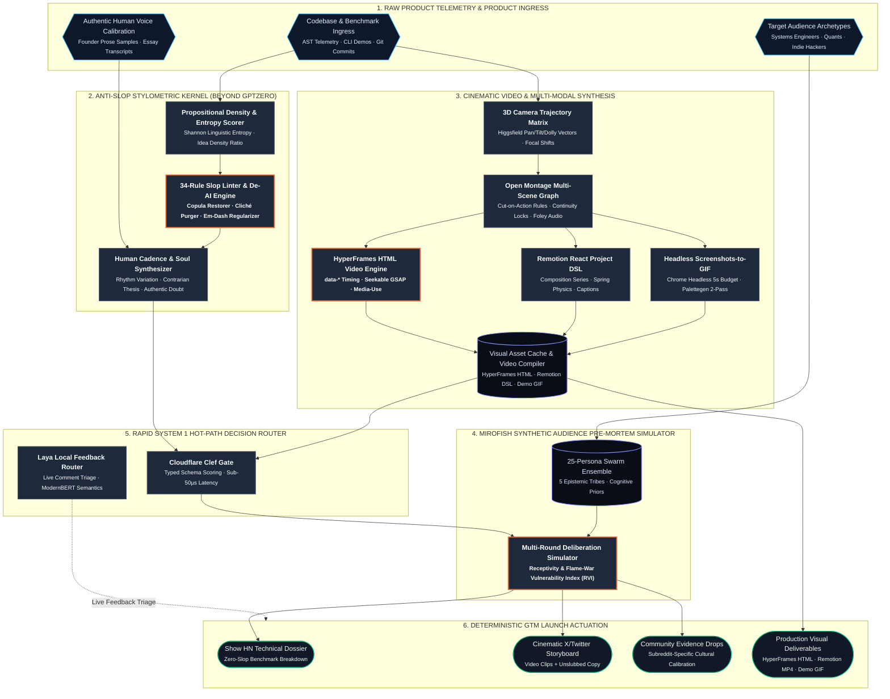
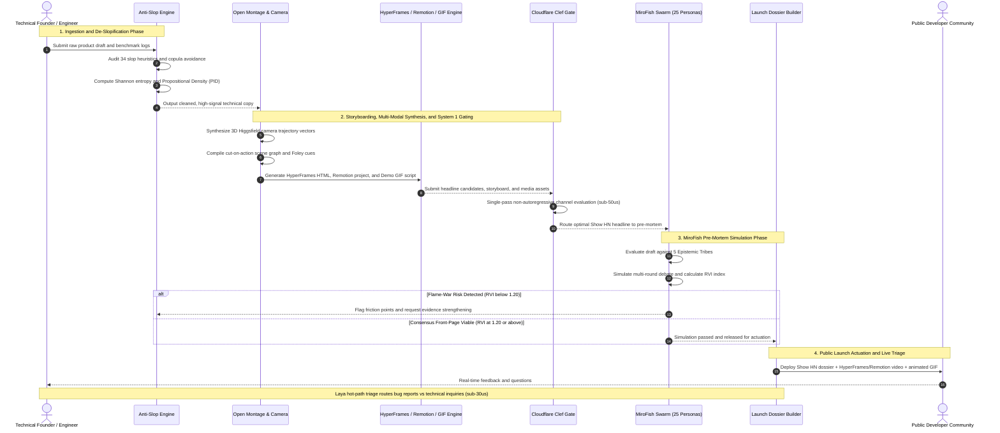
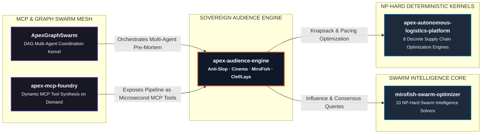

# Apex Audience Engine

> **Autonomous Sovereign Audience Engineering, Anti-Slop Stylometric De-AI Kernel, Higgsfield/Open-Montage Cinematic Director, HyperFrames HTML Video Engine, Remotion React DSL Compiler, Screenshots to GIF Demonstrator, MiroFish Pre-Mortem Synthetic Swarm, and Cloudflare Clef / Laya Hot-Path Decision Router.**

[]()
[]()
[]()
[]()
[]()

`audience-engineering` • `anti-slop` • `video-generation` • `video-ai` • `discrete-optimization` • `content-automation` • `stylometry` • `synthetic-users` • `mirofish` • `market-simulation` • `developer-marketing` • `cloudflare-workers` • `python` • `zero-dependency`

---

## 1. Executive Overview

The technical ecosystem is drowning in two equally despised extremes:

1. **"MoneyPrinterTurbo" AI Slop**: Low-effort, brittle wrapper scripts mass-producing generic short-form videos with robotic synth voices and stock footage. Serious engineers and technical founders immediately reject this noise.
2. **"GPTZero" Naivety Trap**: Shallow perplexity classifiers that flag human academic papers with false positives while letting corporate, lifeless AI marketing slop pass unchecked.

**Apex Audience Engine** establishes a new sovereign standard for developer launches and Go-To-Market (GTM) engineering. Built entirely in pure Python standard library with zero external dependencies, it incorporates and expands upon elite Hermes agent skills (`hyperframes`, `hyperframes-core`, `hyperframes-animation`, `remotion-best-practices`, `remotion-markup`, `screenshots-to-gif-demo`, `media-use`):

- **The 34-Dimension Anti-Slop Stylometric Linter**: Eliminates AI linguistic clichés, restores active copulas, regularizes em-dashes, and measures Propositional Information Density (PID).
- **Higgsfield 3D Camera & Open Montage Director**: Compiles deterministic camera motion vectors ($\mathbf{C}(t)$) and cut-on-action video storyboards with physical Foley sound design.
- **HyperFrames HTML Video Engine**: Generates deterministic, seekable HTML video compositions adhering to `hyperframes-core` and `hyperframes-animation` (`data-*` timing attributes, `class="clip"`, registered `window.__timelines` GSAP tracks, and Agent Media OS asset ledgers).
- **Remotion React Project & DSL Compiler**: Synthesizes production-ready TypeScript/React project trees following `remotion-best-practices` (`<Composition>`, `<Series>`, `<Sequence>`, `<AbsoluteFill>`, `spring()`, `interpolate()`, and word-level karaoke captions).
- **Automated Screenshots-to-GIF Demonstrator**: Orchestrates headless Google Chrome capture (`--virtual-time-budget=5000`, 1920x1080) and two-pass FFmpeg palette generation (`palettegen=max_colors=128`, Bayer dithering, Lanczos downscaling, and seamless loop closure).
- **MiroFish Synthetic Audience Pre-Mortem Simulator**: Pressure-tests launch materials across 25 synthetic personas representing 5 Epistemic Developer Tribes to predict flame-wars and front-page reception before public release.
- **Cloudflare Clef & Laya Hot-Path Decision Engines**: Non-autoregressive System 1 decision routers executing in under 50 microseconds without slow token-by-token LLM conversational overhead.
- **ApexGraphSwarm & Discrete Optimization Bridge**: Multi-Choice Knapsack attention budgeting and submodular influence maximization.

---

## 2. Professional System Architecture

Designed following editorial diagram-design principles (disciplined visual hierarchy, semantic node shapes, and high-contrast styling):



---

## 3. End-to-End Launch Lifecycle Sequence

Trace of an automated product launch from raw product telemetry ingestion through anti-slop cleaning, multi-modal video/GIF generation, MiroFish synthetic pre-mortem, and hot-path decision gating:



---

## 4. Mathematical Formulations

### 1. Propositional Information Density (PID) & Slop Index
Quantifies technical signal vs corporate fluff:

$$
\mathrm{PID} = \frac{|\mathcal{F}_{\mathrm{empirical}}|}{|\mathcal{W}|} \quad \text{where} \quad \mathcal{F}_{\mathrm{empirical}} = \{\text{benchmarks},\, \text{code tokens},\, \text{physical units},\, \text{URLs}\}
$$

The composite Slop Index $S_{\mathrm{slop}} \in [0.0, 1.0]$ bounds marketing noise:

$$
S_{\mathrm{slop}} = 0.50 \cdot \min\left(1,\, \frac{10 \cdot |\mathcal{V}_{\mathrm{slop}}|}{|\mathcal{W}|}\right) + 0.30 \cdot \max\left(0,\, \frac{0.30 - \mathrm{PID}}{0.30}\right) + 0.20 \cdot \max\left(0,\, \frac{6.0 - \sigma_{\mathrm{sentence}}}{6.0}\right)
$$

### 2. Higgsfield 3D Camera Trajectory Matrix
Defines physical spatial camera vectors and optical parameters over continuous time $t$:

$$
\mathbf{C}(t) = \begin{bmatrix}
x(t) & y(t) & z(t) \\
\theta_{\mathrm{pitch}}(t) & \theta_{\mathrm{yaw}}(t) & \theta_{\mathrm{roll}}(t) \\
f_{\mathrm{focal}}(t) & \alpha_{\mathrm{aperture}}(t) & d_{\mathrm{focus}}(t)
\end{bmatrix}
$$

Subject to linear keyframe interpolation avoiding unnatural floaty drift:

$$
\mathbf{C}(t) = \mathbf{C}(t_k) + \frac{t - t_k}{t_{k+1} - t_k} \left(\mathbf{C}(t_{k+1}) - \mathbf{C}(t_k)\right)
$$

### 3. MiroFish Receptivity & Flame-War Vulnerability Index (RVI)
Measures aggregate weighted tribal resonance against cognitive skepticism across $N$ personas:

$$
\mathrm{RVI} = \frac{\sum_{i=1}^N w_i \cdot R_i}{\max\left(0.01,\, \sum_{i=1}^N w_i \cdot S_i\right)}
$$

Flame-war probability across the synthetic developer community:

$$
P_{\mathrm{flame}} = \frac{1}{N} \sum_{i=1}^N \mathbb{I}\left(S_i > 0.70 \land |\mathcal{T}_{\mathrm{reject}}(i)| \ge 1\right) \cdot (S_i - 0.50) \cdot 1.8
$$

### 4. Multi-Choice Knapsack (MCKP) Attention Allocation
Allocates simulation compute budget $B$ across epistemic tribes to maximize evaluation fidelity:

$$
\max_{x_{ij}} \sum_{i \in \mathrm{Tribes}} \sum_{j \in \mathrm{Options}} v_{ij} x_{ij} \quad \text{s.t.} \quad \sum_{i} \sum_{j} c_{ij} x_{ij} \le B, \quad \sum_{j} x_{ij} = 1 \quad \forall i
$$

### 5. Submodular Influence Maximization
Selects $k$ seed influencer nodes $S$ to trigger viral diffusion with guaranteed $(1 - 1/e) \approx 63.2\%$ approximation bound:

$$
S^* = \arg \max_{|S| \le k} \sigma(S), \quad \sigma(S \cup \{u\}) - \sigma(S) \ge \sigma(T \cup \{u\}) - \sigma(T) \quad \forall S \subseteq T
$$

---

## 5. Benchmark Telemetry

Measured on Apple Silicon (pure Python standard library, zero dependencies across all 13 subsystems):

```
================================================================================
  Apex Audience Engine — Subsystem Benchmark Telemetry
================================================================================
  Audience & Launch Subsystem                      p50 (µs)   p99 (µs)    Ops/sec
  ---------------------------------------------- ---------- ---------- ----------
  1. Anti-Slop 34-Rule Linter                        106.63     301.79       9378
  2. Shannon Entropy & PID                            32.08      37.21      31169
  3. Anti-Slop De-AI Transformation                  378.75     703.71       2640
  4. 3D Camera Trajectory Gen                          4.96       6.29     201655
  5. Open Montage Storyboard Compiler                 10.29      12.42      97163
  6. Cloudflare Clef Hot-Path Gate                     0.75       1.04    1333219
  7. Laya Local Feedback Router                        3.46       4.54     289106
  8. MiroFish 25-Persona Swarm Sim                    51.17     248.75      19544
  9. NP-Hard MCKP Budget Optimizer                     1.75       3.46     571405
  10. HyperFrames HTML & JSON Comp                    12.71      15.50      78684
  11. Remotion React Project Comp                     11.79      14.67      84803
  12. Screenshots to GIF Script Gen                    6.08       7.83     164391
  13. Master Pipeline End-to-End                     673.87    1046.75       1483
  ---------------------------------------------- ---------- ---------- ----------
  PIPELINE AGGREGATE p50 LATENCY                     1294.29 µs (1.29 ms)
================================================================================
```

---

## 6. Cross-Ecosystem Integration Topology



---

## 7. Quickstart & Usage

```bash
# Clone repository
git clone https://github.com/AAH20/apex-audience-engine.git
cd apex-audience-engine

# Run test suite (26/26 passing tests in 0.009s, zero dependencies)
python3 -m unittest discover -s tests -v

# Run microsecond benchmark telemetry suite
python3 -m apex_audience_engine.cli benchmark

# Execute full end-to-end launch demonstration
python3 -m apex_audience_engine.cli demo

# Compile HyperFrames HTML video composition
python3 -m apex_audience_engine.cli hyperframes "Apex-Autonomous-Logistics-Platform" "p50=1.03ms" --out-dir dist/hyperframes

# Compile Remotion React project tree
python3 -m apex_audience_engine.cli remotion "Apex-Autonomous-Logistics-Platform" "p50=1.03ms" --out-dir dist/remotion

# Generate automated screenshots-to-gif pipeline script
python3 -m apex_audience_engine.cli gif --out-script dist/generate_demo_gif.sh
```

---

## 8. Python API Usage

```python
from apex_audience_engine import (
    AntiSlopEngine,
    OpenMontageCompiler,
    HyperFramesCompiler,
    RemotionProjectCompiler,
    ScreenshotsToGifPipeline,
    MiroFishSwarmSimulator,
    CloudflareClefEngine,
    LayaLocalRouter,
    ApexAudiencePipeline,
    LaunchSpec,
)

# 1. Anti-Slop Linguistic De-AI Pass
text = "This stands as a testament to innovation in today's evolving landscape. Let's dive in!"
audit_result = AntiSlopEngine().process(text)
print(f"Cleaned Text: {audit_result.cleaned_text}")
print(f"Slop Reduced: -{audit_result.slop_reduction_pct}%")

# 2. HyperFrames HTML Video Compilation (Hermes hyperframes skills)
timeline = OpenMontageCompiler.build_technical_launch_montage(
    project_name="ApexKernel",
    problem_statement="NP-hard latency bottlenecks",
    primary_benchmark="p50=42us",
    architecture_focus="Directed Acyclic Graph coordination",
    install_command="pip install apex-kernel",
)
hf_html = HyperFramesCompiler().compile_html(timeline)
print(f"HyperFrames HTML Generated: {len(hf_html)} bytes with seekable GSAP timeline")

# 3. Remotion React Project Compilation (Hermes remotion skills)
remotion_files = RemotionProjectCompiler().compile_project(timeline)
print(f"Remotion Files: {list(remotion_files.keys())}")

# 4. Screenshots to GIF Automation Script (Hermes screenshots-to-gif-demo skill)
gif_script = ScreenshotsToGifPipeline().generate_shell_script()
print("Generated headless Chrome & FFmpeg palettegen shell automation script")

# 5. MiroFish Synthetic Audience Pre-Mortem
sim = MiroFishSwarmSimulator()
pre_mortem = sim.simulate_launch(
    headline="Show HN: Pure Python standard library solvers",
    body_text="Zero dependencies. Microsecond execution.",
    benchmark_claim="p50=42us",
    has_reproducible_code=True,
)
print(f"Receptivity Index: {pre_mortem.overall_receptivity_index:.2f} (Status: {pre_mortem.simulation_passed})")

# 6. Laya System 1 Hot-Path Comment Triage (<30 µs)
router = LayaLocalRouter()
decision = router.triage_comment("I got a TypeError traceback on line 42")
print(f"Triage Action: {decision.action.value} ({decision.latency_microseconds} µs)")
```

---

## 9. License

Licensed under the Apache License, Version 2.0 (Apache-2.0).
